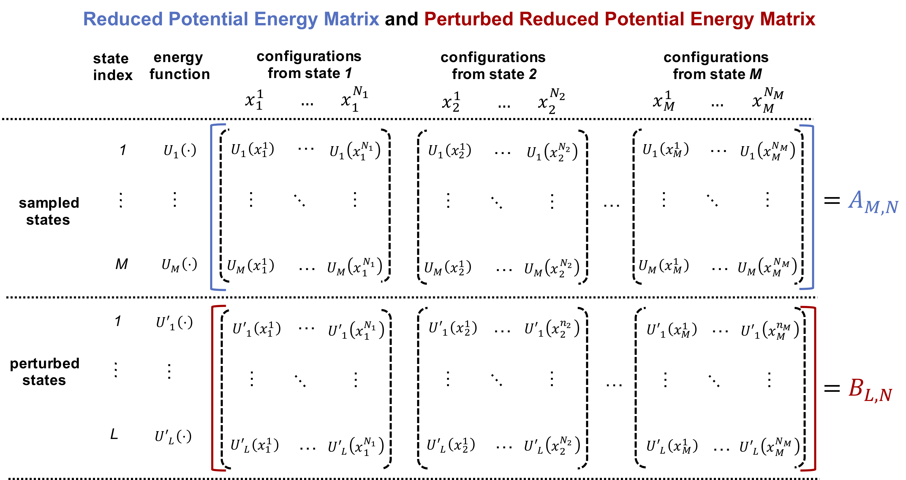

# A Fast Solver for Large Scale MBAR/UWHAM Equations
The multistate Bennett acceptance ratio (MBAR) and unbinned weighted histogram analysis method (UWHAM) are widely imployed approaches to calculate free energies of multiple thermodynamcis states.
They are routinely used in alchemical free energy calculations, umbrella sampling, and temperature/Hamiltonian replica exchange simulations to calculate free engies and potentials of mean force (PMF).

`FastMBAR` is a solver written in Python to solve large scale multistate Bennett acceptance ratio (MBAR)/unbinned weighted histogram analysis method (UWHAM) equations. Compared with the widely used python package `pymbar`, `FastMBAR` is 3 times faster on CPUs and more than two orders of magnitude faster on GPUs.

## Installation
`FastMBAR` can be installed via `conda` or `pip` using the following commands:  
  * using `conda`:  
    - If you want to install `FastMBAR` and dependent packages in the main conda environment, run the command:   
      `conda install -c shawn_ding -c pytorch fastmbar`.
    - If you want to install them in a specific conda environment, run the following commands:  
      `conda create -n myenv_name`  
      `conda install -n myenv_name -c shawn_ding -c pytorch fastmbar`,  
      where you can replace `myenv_name` with whatever name you want.
      
  * using `pip`:  
    `pip install FastMBAR`
## Usage
 
 
