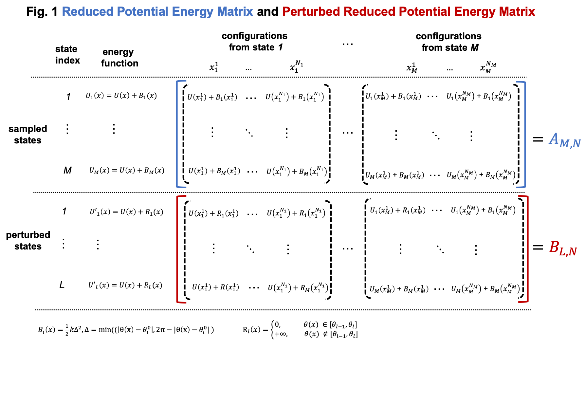
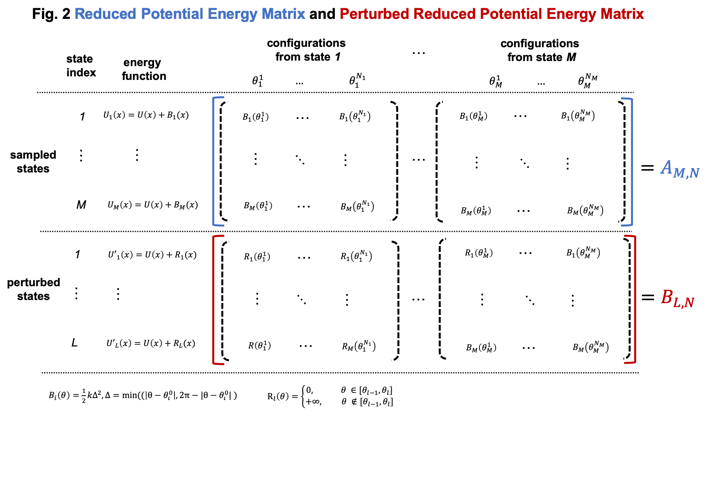
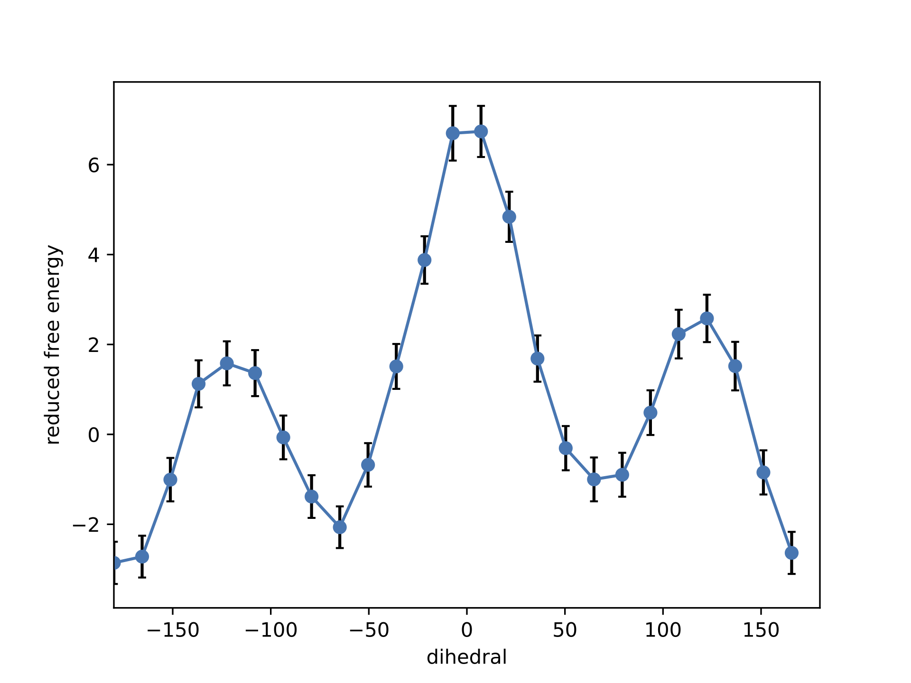

Example 1. Compute the PMF of a dihedral for butane.
==============================================================================

This example includes a step-by-step description on computing the PMF of
butane dihedral between its four carbon atoms with umbrella sampling and FastMBAR.
Umbrella sampling is used to exhaustively sample relevant butane configurations
that are centered around multiple dihedral values.
FastMBAR is used here to compute the PMF by reweighing the configurations
sampled from umbrella sampling.

To run this example in your local computer, you need to clone/download the git repository
`FastMBAR <https://github.com/BrooksResearchGroup-UM/FastMBAR>`_ onto your computer.
After downloading the `FastMBAR`_ repository, change current working directory to
``FastMBAR/examples/butane`` before starting to run the following script inside
the ``Python`` interpreter.

.. code-block:: python
		
   ## import required packages
   import os, math, sys
   import numpy as np
   import matplotlib.pyplot as plt
   import openmm.app  as omm_app
   import openmm as omm
   import openmm.unit as unit
   from tqdm import tqdm
   import mdtraj
   from FastMBAR import *

1. Construct an OpenMM system of butane
---------------------------------------

Because we are using OpenMM as our MD engine, we need to setup the
MD molecular system in the format required by OpenMM. The format/object
used by OpenMM for a molecular system happens to be a class called
`System <http://docs.openmm.org/latest/api-python/generated/openmm.openmm.System.html#openmm.openmm.System>`_.
Therefore, we will prepare our MD molecular system as an OpenMM System.
When we prepare the OpenMM system, we add a
`CustomTorsionForce <http://docs.openmm.org/latest/api-python/generated/openmm.openmm.CustomTorsionForce.html#openmm.openmm.CustomTorsionForce>`_
so that we can add biasing potentials to the system in the following umbrella
sampling.

Read psf and pdb files of butane: butane.psf and butane.pdb.
The psf file, butane.psf, contains topology of butane and it is
the topology file format used by CHARMM.
The psf file, butane.psf, used here is generated using CHARMM.
In your study, you usually already have a pdb file of your system. 
You can generate the topology file of your system using various MD
softwares such as CHARMM, Gromacs and Amber among others.
Just note that different softwares use different format for topology files and OpenMM has 
several parser for topology files with different format.

.. code-block:: python
		
   psf = omm_app.CharmmPsfFile('./data/butane.psf')
   pdb = omm_app.PDBFile('./data/butane.pdb')

Read CHARMM force field for butane. The CHARMM force field is downloaded from `here <http://mackerell.umaryland.edu/charmm_ff.shtml>`_.

.. code-block:: python

   params = omm_app.CharmmParameterSet('./data/top_all35_ethers.rtf',
                                       './data/par_all35_ethers.prm')

Create a OpenMM system based on the psf file of butane and the CHARMM force field.
Then a harmonic biasing potential for butane dihedral (3-6-9-13) is added to the
system so that we can use the biasing potential in the following umbrella sampling.
Adding a biasing potential to a system is very easy in OpenMM. 
We don't have to change any source code of OpenMM. All we need to do is to tell
OpenMM the formula of the biasing potential and degree of freedom we want to
add the biasing potential to.

.. code-block:: python

   ## create an OpenMM system
   system = psf.createSystem(params, nonbondedMethod=omm_app.NoCutoff)

   ## add a harmonic biasing potential on butane dihedral to the OpenMM system
   bias_torsion = omm.CustomTorsionForce("0.5*K*dtheta^2; dtheta = min(diff, 2*Pi-diff); diff = abs(theta - theta0)")
   bias_torsion.addGlobalParameter("Pi", math.pi)
   bias_torsion.addGlobalParameter("K", 1.0)
   bias_torsion.addGlobalParameter("theta0", 0.0)
   ## 3, 6, 9, 13 are indices of the four carton atoms in butane, between which
   ## the dihedral angle is biased.
   bias_torsion.addTorsion(3, 6, 9, 13)
   system.addForce(bias_torsion)

After constructing the OpenMM system of butane, we can save it in an XML formatted text file,
which can be used later for simulations. Therefore, if we want to use the same system in
another script, we can just read the text file in an OpenMM system instead of constructing it again.
You can even open the XML formatted text file using a text editor and see what information
about the system is included in the XML file.

.. code-block:: python

   ## save the OpenMM system of butane
   with open("./output/system.xml", 'w') as file_handle:
       file_handle.write(omm.XmlSerializer.serialize(system))

2. Run umbrella sampling
------------------------

We run umbrella sampling for the butane dihedral (atom indices: 3-6-9-13).
The dihedral is split into multiple windows and in each window, the dihedral
is restrained around a center using a harmonic biasing potential. In this
script, we run simulations in each window sequentially, but they can be run in
parallel if you have a computer cluster with multiple nodes.       

.. code-block:: python

   ## read the OpenMM system of butane
   with open("./output/system.xml", 'r') as file_handle:
       xml = file_handle.read()
   system = omm.XmlSerializer.deserialize(xml)

   ## read psf and pdb file of butane
   psf = omm_app.CharmmPsfFile("./data/butane.psf")
   pdb = omm_app.PDBFile('./data/butane.pdb')

In order to run simulations in OpenMM, we need to construct an OpenMM context,
which consists of a system, an integrator and a platform.
The system is just the butane system we have constructed above.
The integrator specifies what kind integration method we should use.
Here, we will use Langevin dynamics for NVT ensemble simulation,
which corresponds to the OpenMM.LangevinMiddleIntegrator.
The platform specifies what kind of hardware we will run simulation on.
Here, we choose to use CPUs because the size of the system is quite small.

.. code-block:: python
		
   #### setup an OpenMM context

   ## platform
   platform = omm.Platform.getPlatformByName('CPU')

   ## integrator
   T = 298.15 * unit.kelvin  ## temperature
   fricCoef = 10/unit.picoseconds ## friction coefficient 
   stepsize = 1 * unit.femtoseconds ## integration step size
   integrator = omm.LangevinMiddleIntegrator(T, fricCoef, stepsize)

   ## construct an OpenMM context
   context = omm.Context(system, integrator, platform)

Here we set the force constant and centers for the harmonic biasing potentials on butane dihedral.

.. code-block:: python
		
   ## set force constant K for the biasing potential. 
   ## the unit here is kJ*mol^{-1}*nm^{-2}, which is the default unit used in OpenMM
   K = 100
   context.setParameter("K", K)

   ## M centers of harmonic biasing potentials
   M = 20
   theta0 = np.linspace(-math.pi, math.pi, M, endpoint = False)
   np.savetxt("./output/theta0.csv", theta0, delimiter = ",")

The following loop is used to run umbrella sampling window by window.
In each iteration, we first set the center of the harmonic biasing potential.
Then the configuration of butane is minimized and equilibrated with the biasing potential.
After initial equilibration, configurations are sampled and saved.

.. code-block:: python

   ## the main loop to run umbrella sampling window by window
   for theta0_index in range(M):
       print(f"sampling at theta0 index: {theta0_index} out of {M}")
   
       ## set the center of the biasing potential
       context.setParameter("theta0", theta0[theta0_index])
   
       ## minimize
       context.setPositions(pdb.positions)
       state = context.getState(getEnergy = True)
       energy = state.getPotentialEnergy()
       for i in range(50):
           omm.LocalEnergyMinimizer.minimize(context, 1, 20)
           state = context.getState(getEnergy = True)
           energy = state.getPotentialEnergy()
   
       ## initial equilibrium
       integrator.step(5000)
   
       ## sampling production. trajectories are saved in dcd files
       file_handle = open(f"./output/traj/traj_{theta0_index}.dcd", 'bw')
       dcd_file = omm_app.dcdfile.DCDFile(file_handle, psf.topology, dt = stepsize)
       for i in tqdm(range(300)):
           integrator.step(100)
           state = context.getState(getPositions = True)
           positions = state.getPositions()
           dcd_file.writeModel(positions)
       file_handle.close()   

3. Compute and collect the butane dihedral values
-------------------------------------------------

For configurations in trajectories sampled using umbrella sampling,
we compute the butane dihedral and
save them in csv files. The dihedral is between four atoms with
indices of 3, 6, 9, and 13. 
Here we use the Python package mdtraj to compute dihedrals.

.. code-block:: python
		
   topology = mdtraj.load_psf("./data/butane.psf")
   for theta0_index in range(M):
       traj = mdtraj.load_dcd(f"./output/traj/traj_{theta0_index}.dcd", topology, stride = 10)
       theta = mdtraj.compute_dihedrals(traj, [[3, 6, 9, 13]])
       np.savetxt(f"./output/dihedral/dihedral_{theta0_index}.csv", theta, fmt = "%.5f", delimiter = ",")

4. Use FastMBAR to solve MBAR/UWHAM equations and compute the PMF
-----------------------------------------------------------------

Two steps are required to compute PMF using FastMBAR based on umbrella sampling.
Firstly, we need to compute the relative free energies of the biased ensembles used in umbrella sampling,
i.e., the NVT ensembles with biased potential energies.
Secondly, samples from umbrella sampling are reweighed to compute the PMF.

Simulations in umbrella sampling have different biasing potential energies.
They are viewed as different thermodynamic states.
Therefore, we have :math:`M` states and samples from these states.
As shown in Usage, we can use FastMBAR to compute the relative free energies of these :math:`M` states.
In order to do it, we need to compute the reduced energy matrix :math:`A_{M,N}` as shown in Fig. 1,
where :math:`U(x)` is the potential energy function; :math:`B_i(x)` is the biasing potential added
in the :math:`i` th state. In this case, the biasing potential is added to the dihedral (3-6-9-13),
so :math:`B_i(x) = 0.5*k*\Delta^2`, where :math:`\Delta = min(|\theta(x) - \theta^0_i|, 2\pi - |\theta(x) - \theta^0_i|)`
and :math:`\theta(x)` is the dihedral (3-6-9-13) calculated based on Cartesian coordinates :math:`x` .

Compared to general cases, the reduced potential energy matrix :math:`A_{M,N}` in umbrella sampling has a special property.
The energy functions of the :math:`M` states are :math:`U(x) + B_i(x)`. They all have the common component :math:`U(x)`.
Removing the common component :math:`U(x)` from the energy matrix :math:`A_{M,N}` does not affect the relative free
energies of the :math:`M` states. Therefore, we can omitting computing :math:`U(x)` when compute the energy matrix :math:`A_{M,N}`,
as shown in Fig. 2
	   

As shown in Fig. 2, we can compute the reduced energy matrix :math:`A_{M,N}` just based on dihedral values from umbrella sampling.
In the following script, we read the dihedral values and compute the reduced energy matrix :math:`A_{M,N}`.
Based on the reduced energy matrix and the number of conformations sampled from each state,
we can compute the relative free energies of the :math:`M` states using FastMBAR.

.. code-block:: python
		
   ## read dihedral values from umbrella sampling
   thetas = []
   num_conf = []
   for theta0_index in range(M):
       theta = np.loadtxt(f"./output/dihedral/dihedral_{theta0_index}.csv", delimiter = ",")
       thetas.append(theta)
       num_conf.append(len(theta))
   thetas = np.concatenate(thetas)
   num_conf = np.array(num_conf)
   N = len(thetas)
   
   ## compute reduced energy matrix A
   A = np.zeros((M, N))
   K = 100
   T = 298.15 * unit.kelvin
   kbT = unit.BOLTZMANN_CONSTANT_kB * 298.15 * unit.kelvin * unit.AVOGADRO_CONSTANT_NA
   kbT = kbT.value_in_unit(unit.kilojoule_per_mole)
   
   theta0 = np.loadtxt("./output/theta0.csv", delimiter = ",")
   
   for theta0_index in range(M):
       current_theta0 = theta0[theta0_index]
       diff = np.abs(thetas - current_theta0)
       diff = np.minimum(diff, 2*math.pi-diff)
       A[theta0_index, :] = 0.5*K*diff**2/kbT
   
   ## solve MBAR equations using FastMBAR
   fastmbar = FastMBAR(energy = A, num_conf = num_conf, cuda=False, verbose = True)
   print("Relative free energies: ", fastmbar.F)

Now we are ready to compute the PMF.
Solving MBAR equations yields the relative free energies of the :math:`M` states,
all of which have biasing potential energies.
Knowing the relative free energies of the :math:`M` states enables us to compute
the PMF using an easy reweighing procedure.
In order to do that, we need to compute the energy matrix :math:`B_{L,N}` as shown in Fig. 1 and Fig. 2.

To represent the PMF of the dihedral, we split the dihedral range, :math:`[-\pi, \pi]` into :math:`L` windows: :math:`[\theta_{l-1}, \theta_l]` for :math:`l = 1, ..., L`.
Then we can represent the PMF by computing the relative free energies of these $L$ states each of which has a potential energy of :math:`U(x)`.
Because the :math:`l` th state is constrained in the dihedral range :math:`[\theta_{l-1}, \theta_l]`,
we need to add a biasing potential :math:`R_l(\theta)` to enforce the constraint.
The value of the biasing potential :math:`R_l(\theta) = R_l(\theta(x))` is 0 when :math:`\theta \in [\theta_{l-1}, \theta_l]`, infinity otherwise.

.. code-block:: python
		
   ## compute the reduced energy matrix B
   L = 25
   theta_PMF = np.linspace(-math.pi, math.pi, L, endpoint = False)
   width = 2*math.pi / L
   B = np.zeros((L, N))
   
   for i in range(L):
       theta_center = theta_PMF[i]
       theta_low = theta_center - 0.5*width
       theta_high = theta_center + 0.5*width
   
       indicator = ((thetas > theta_low) & (thetas <= theta_high)) | \
                    ((thetas + 2*math.pi > theta_low) & (thetas + 2*math.pi <= theta_high)) | \
                    ((thetas - 2*math.pi > theta_low) & (thetas - 2*math.pi <= theta_high))
   
       B[i, ~indicator] = np.inf
   
   ## compute PMF using the energy matrix B
   results = fastmbar.calculate_free_energies_of_perturbed_states(B)
   PMF = results['F']
   PMF_uncertainty = results['F_std']
   
   ## plot the PMF
   fig = plt.figure(0)
   fig.clf()
   plt.errorbar(theta_PMF*180/math.pi, PMF, yerr = PMF_uncertainty, fmt = '-o', 
   ecolor = 'black', capsize = 2, capthick = 1, markersize = 6)
   plt.xlim(-180, 180)
   plt.xlabel("dihedral")
   plt.ylabel("reduced free energy")
   plt.savefig("./output/PMF_fastmbar.pdf")

The PMF saved in the file ``./output/PMF_fastmbar.pdf`` should be like the following PMF:

	   
