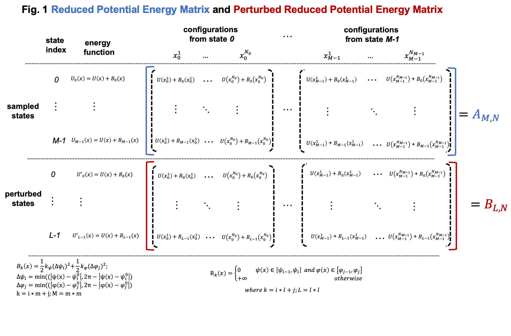
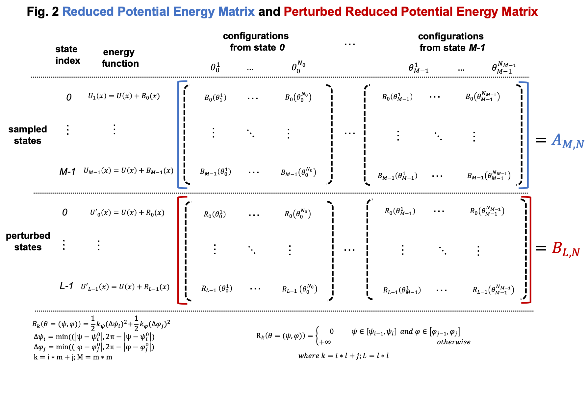
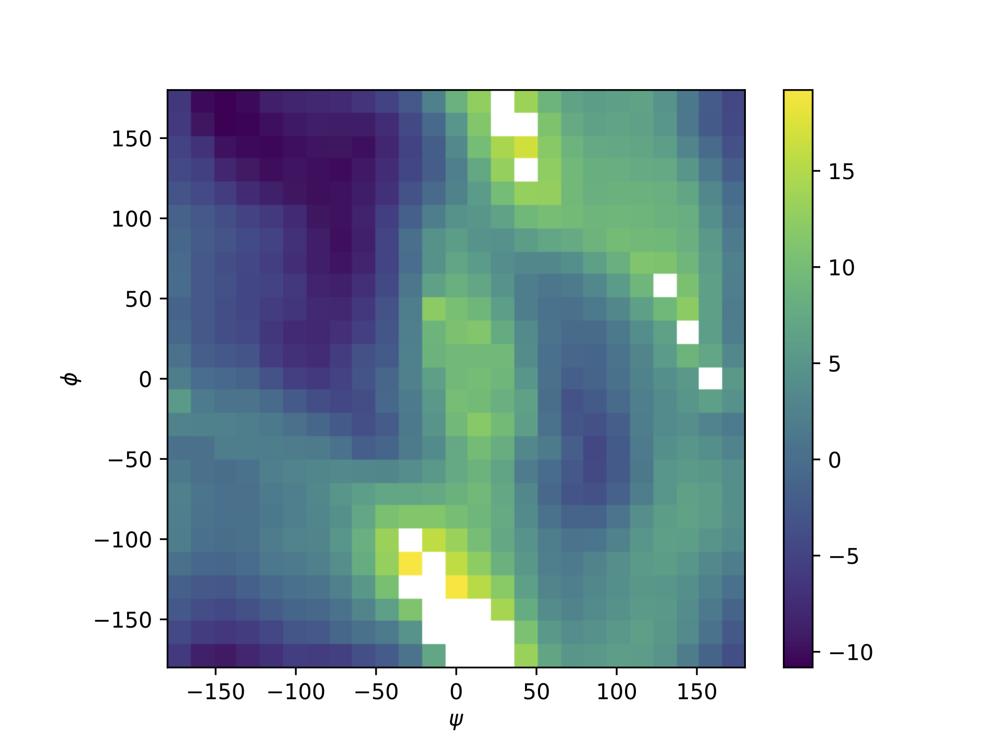

Example 2. Compute a 2D-PMF of dihedrals for dialanine.
=================================================================================

This example includes a step-by-step description on computing the two dimensional PMF of
dialanine dihedrals with umbrella sampling and FastMBAR.
Umbrella sampling is used to exhaustively sample relevant dialanine configurations
that are centered around multiple dihedral values.
FastMBAR is used here to compute the PMF by reweighing the configurations
sampled from umbrella sampling.

To run this example in your local computer, you need to clone/download the git repository
`FastMBAR <https://github.com/BrooksResearchGroup-UM/FastMBAR>`_ onto your computer.
After downloading the `FastMBAR`_ repository, change current working directory to
``FastMBAR/examples/dialanine`` before starting to run the following script inside
the ``Python`` interpreter.

.. code-block:: python
		
   ## import required packages
   import os, math, sys
   import numpy as np
   import matplotlib.pyplot as plt
   import openmm.app  as omm_app
   import openmm as omm
   import openmm.unit as unit
   from tqdm import tqdm
   import mdtraj
   from FastMBAR import *

1. Construct an OpenMM system of dialanine
-------------------------------------------

Because we are using OpenMM as our MD engine, we need to setup the
MD molecular system in the format required by OpenMM. The format/object
used by OpenMM for a molecular system happens to be a class called
`System <http://docs.openmm.org/latest/api-python/generated/openmm.openmm.System.html#openmm.openmm.System>`_.
Therefore, we will prepare our MD molecular system as an OpenMM System.
When we prepare the OpenMM system, we add a
`CustomTorsionForce <http://docs.openmm.org/latest/api-python/generated/openmm.openmm.CustomTorsionForce.html#openmm.openmm.CustomTorsionForce>`_
so that we can add biasing potentials to the system in the following umbrella
sampling.

Read psf and pdb files of dialanine: dialanine.psf and dialanine.pdb.
The psf file, dialanine.psf, contains topology of dialanine and it is
the topology file format used by CHARMM.
The psf file, dialanine.psf, used here is generated using CHARMM.
In your study, you usually already have a pdb file of your system. 
You can generate the topology file of your system using various MD
softwares such as CHARMM, Gromacs and Amber among others.
Just note that different softwares use different format for topology files and OpenMM has 
several parser for topology files with different format.

.. code-block:: python
		
   psf = omm_app.CharmmPsfFile('./data/dialanine.psf')
   pdb = omm_app.PDBFile('./data/dialanine.pdb')

Read CHARMM force field for dialanine. The CHARMM force field is downloaded from `here <http://mackerell.umaryland.edu/charmm_ff.shtml>`_.

.. code-block:: python

   charmm_toppar = omm_app.CharmmParameterSet('./data/top_all36_prot.rtf',
                                              './data/par_all36_prot.prm')

Create a OpenMM system based on the psf file of dialanine and the CHARMM force field.
Then two harmonic biasing potentials are added to the system for dihedral :math:`\psi` (4-6-8-14) 
and dihedral :math:`\phi` (6-8-14,16) so that we can use biasing potentials in the following 
umbrella sampling.
Adding biasing potentials to torsions of a system is very easy in OpenMM. 
We don't have to change any source code of OpenMM. All we need to do is to tell OpenMM 
the formula of the biasing potential and degree of freedom we want to add biasing potentials to.					      

.. code-block:: python
		
   ## create a OpenMM system based on psf of dialanine and CHARMM force field
   system = psf.createSystem(charmm_toppar, nonbondedMethod = omm_app.NoCutoff)

   ## add harmonic biasing potentials on two dihedrals of dialanine (psi, phi) in the OpenMM system
   ## for dihedral psi
   bias_torsion_psi = omm.CustomTorsionForce("0.5*k_psi*dtheta^2; dtheta = min(tmp, 2*pi-tmp); tmp = abs(theta - psi)")
   bias_torsion_psi.addGlobalParameter("pi", math.pi)
   bias_torsion_psi.addGlobalParameter("k_psi", 1.0)
   bias_torsion_psi.addGlobalParameter("psi", 0.0)
   ## 4, 6, 8, 14 are indices of the atoms of the torsion psi
   bias_torsion_psi.addTorsion(4, 6, 8, 14)

   ## for dihedral phi
   bias_torsion_phi = omm.CustomTorsionForce("0.5*k_phi*dtheta^2; dtheta = min(tmp, 2*pi-tmp); tmp = abs(theta - phi)")
   bias_torsion_phi.addGlobalParameter("pi", math.pi)
   bias_torsion_phi.addGlobalParameter("k_phi", 1.0)
   bias_torsion_phi.addGlobalParameter("phi", 0.0)
   ## 6, 8, 14, 16 are indices of the atoms of the torsion phi
   bias_torsion_phi.addTorsion(6, 8, 14, 16)
    
   system.addForce(bias_torsion_psi)
   system.addForce(bias_torsion_phi)
		
After constructing the OpenMM system of dialanine, we can save it in an XML formatted text file,
which can be used later for simulations. Therefore, if we want to use the same system in
another script, we can just read the text file in an OpenMM system instead of constructing it again.
You can even open the XML formatted text file using a text editor and see what information
about the system is included in the XML file.

.. code-block:: python

   ## save the OpenMM system of dialanine
   with open("./output/system.xml", 'w') as file_handle:
       file_handle.write(omm.XmlSerializer.serialize(system))

2. Run umbrella sampling
------------------------

We run umbrella sampling for two dialanine dihedrals: dihedral :math:`\psi` with atom indices of 
4-6-8-14 and dihedral :math:`\phi` with atom indices of 6-8-14-16.
Both dihedrals are split into multiple windows and in each window, the two dihedrals
are restrained around a center using a harmonic biasing potential. In this
script, we run simulations in each window sequentially, but they can be run in
parallel if you have a computer cluster with multiple nodes.

.. code-block:: python

   ## read the OpenMM system of dialanine
   with open("./output/system.xml", 'r') as file_handle:
       xml = file_handle.read()
   system = omm.XmlSerializer.deserialize(xml)

   ## read psf and pdb file of dialanine
   psf = omm_app.CharmmPsfFile("./data/dialanine.psf")
   pdb = omm_app.PDBFile('./data/dialanine.pdb')

In order to run simulations in OpenMM, we need to construct an OpenMM context, which consists of 
a system, an integrator and a platform.
The system is just the dialanine system we have constructed above.
The integrator specifies what kind integration method we should use. Here, we will use 
Langevin dynamics for NVP ensemble simulation, which corresponds to the 
OpenMM.LangevinMiddleIntegrator.
The platform specifies what kind of hardware we will run simulation on. 
Here, we choose to use CPUs.

.. code-block:: python
		
   #### setup an OpenMM context

   ## platform
   platform = omm.Platform.getPlatformByName('CPU')

   ## integrator
   T = 298.15 * unit.kelvin  ## temperature
   fricCoef = 10/unit.picoseconds ## friction coefficient 
   stepsize = 1 * unit.femtoseconds ## integration step size
   integrator = omm.LangevinMiddleIntegrator(T, fricCoef, stepsize)

   ## construct an OpenMM context
   context = omm.Context(system, integrator, platform)

Here we set the force constant and centers for the harmonic biasing potentials on dialanine dihedral.

.. code-block:: python
		
   ## set force constant K for the biasing potential. 
   ## the unit here is kJ*mol^{-1}*nm^{-2}, which is the default unit used in OpenMM
   k_psi = 100
   k_phi = 100
   context.setParameter("k_psi", k_psi)
   context.setParameter("k_phi", k_phi)

   ## equilibrium value for both psi and phi in biasing potentials
   m = 25
   M = m*m
   psi = np.linspace(-math.pi, math.pi, m, endpoint = False)
   phi = np.linspace(-math.pi, math.pi, m, endpoint = False)
   
The following loop is used to run umbrella sampling window by window.
In each iteration, we first set the centers of the two harmonic biasing potentials.
Then the configuration of dialanine is minimized and equilibrated with the biasing potentials.
After initial equilibration, configurations are sampled and saved.

.. code-block:: python
		
   ## the main loop to run umbrella sampling window by window
   for idx in range(M):
       psi_index = idx // m
       phi_index = idx % m

       print(f"sampling at psi index: {psi_index} out of {m}, phi index: {phi_index} out of {m}")

       ## set the center of the biasing potential
       context.setParameter("psi", psi[psi_index])
       context.setParameter("phi", phi[phi_index])

       ## minimize
       context.setPositions(pdb.positions)
       state = context.getState(getEnergy = True)
       energy = state.getPotentialEnergy()
       for i in range(50):
           omm.LocalEnergyMinimizer.minimize(context, 1, 20)
           state = context.getState(getEnergy = True)
           energy = state.getPotentialEnergy()

       ## initial equilibrium
       integrator.step(5000)

       ## sampling production. trajectories are saved in dcd files
       file_handle = open(f"./output/traj/traj_psi_{psi_index}_phi_{phi_index}.dcd", 'bw')
       dcd_file = omm_app.dcdfile.DCDFile(file_handle, psf.topology, dt = stepsize)
       for i in tqdm(range(100)):
           integrator.step(100)
           state = context.getState(getPositions = True)
           positions = state.getPositions()
           dcd_file.writeModel(positions)
       file_handle.close()
		
3. Compute and collect values of both dialanine dihedral 
---------------------------------------------------------

For configurations in trajectories sampled using umbrella sampling, we compute the two alanine dihedral :math:`\psi` and :math:`\phi` and
save them in csv files. The dihedral :math:`\psi` is between four atoms with indices of 4, 6, 8, and 14. The dihedral :math:`\phi` is between four atoms with indices of 6, 8, 14, 16.
Here we use the Python package mdtraj to compute dihedrals.

.. code-block:: python
		
   topology = mdtraj.load_psf("./output/dialanine.psf")
   K = 100

   m = 25
   M = m*m
   psi = np.linspace(-math.pi, math.pi, m, endpoint = False)
   phi = np.linspace(-math.pi, math.pi, m, endpoint = False)

   psis = []
   phis = []
   for psi_index in range(m):
       for phi_index in range(m):
           traj = mdtraj.load_dcd(f"./output/traj/traj_psi_{psi_index}_phi_{phi_index}.dcd", topology)
           psis.append(mdtraj.compute_dihedrals(traj, [[4, 6, 8, 14]]))
           phis.append(mdtraj.compute_dihedrals(traj, [[6, 8, 14, 16]]))

   psi_array = np.squeeze(np.stack(psis))
   phi_array = np.squeeze(np.stack(phis))
   
4. Use FastMBAR to solve MBAR/UWHAM equations and compute the PMF
-----------------------------------------------------------------

Two steps are required to compute PMF using FastMBAR based on umbrella sampling.
Firstly, we need to compute the relative free energies of the biased ensembles used in 
umbrella sampling, i.e., the NVT ensembles with biased potential energies.
Secondly, samples from umbrella sampling are reweighed to compute the PMF.

Simulations in umbrella sampling have different biasing potential energies. 
They are viewed as different thermodynamic states. Therefore, we have :math:`M` states and 
samples from these states.
As shown in Usage, we can use FastMBAR to compute the relative free energies of these :math:`M` 
states.
In order to do it, we need to compute the reduced energy matrix :math:`A_{M,N}` as shown 
in Fig. 1, where :math:`U(x)` is the potential energy function; :math:`B_k(x)` is 
the biasing potential added in the :math:`i` th state. 
In this case, biasing potentials are added to dihedral :math:`\psi` (4-6-8-14) and 
dihedral :math:`\phi` (6-8,14,16).
:math:`B_k(x) = 0.5*k_{\psi}*\Delta\psi^2 + 0.5*k_{\phi}*\Delta\phi^2`, 
where :math:`\Delta\psi = min(|\psi(x) - \psi^0_i|, 2\pi - |\psi(x) - \psi^0_i|)`, 
:math:`\Delta\phi = min(|\phi(x) - \phi^0_j|, 2\pi - |\phi(x) - \phi^0_j|)` 
where :math:`\psi(x)` and :math:`\phi(x)` are the dihedrals (4-6-8-14 and 6-8-14-16) 
calculated based on Cartesian coordinates :math:`x`; :math:`\psi^0_i` 
is :math:`i` th equilibrium torsion for :math:`\psi` used in umbrella sampling; 
:math:`\phi^0_j` is :math:`j` th equilibrium torsion for :math:`\phi` used inf 
umbrella sampling. We cam compute :math:`i` and :math:`j` based on :math:`k = i*m + j, M = m*m`.

Compared to general cases, the reduced potential energy matrix :math:`A_{M,N}` in
umbrella sampling has a special property. The energy functions of the :math:`M` states
are :math:`U(x) + B_k(x)`. They all have the common component :math:`U(x)`.
Removing the common component :math:`U(x)` from the energy matrix :math:`A_{M,N}` does 
not affect the relative free energies of the :math:`M` states. 
Therefore, we can omitting computing :math:`U(x)` when compute the 
energy matrix :math:`A_{M,N}`, as shown in Fig. 2
	   

As shown in Fig. 2, we can compute the reduced energy matrix :math:`A_{M,N}` just
based on dihedral values from umbrella sampling.
In the following script, we read the dihedral values and compute the 
reduced energy matrix :math:`A_{M,N}`.
Based on the reduced energy matrix and the number of conformations sampled from each state,
we can compute the relative free energies of the :math:`M` states using FastMBAR.

.. code-block:: python
		
   ## compute energy matrix A
   T = 298.15 * unit.kelvin
   kbT = unit.BOLTZMANN_CONSTANT_kB * 298.15 * unit.kelvin * unit.AVOGADRO_CONSTANT_NA
   kbT = kbT.value_in_unit(unit.kilojoule_per_mole)
   
   n = psi_array.shape[1]
   A = np.zeros((M, n*M))
   
   psi_array = np.reshape(psi_array, (-1,))
   phi_array = np.reshape(phi_array, (-1,))
   
   for index in range(M):
       psi_index = index // m
       phi_index = index % m
   
       psi_c = psi[psi_index]
       phi_c = phi[phi_index]
   
       psi_diff = np.abs(psi_array - psi_c)
       psi_diff = np.minimum(psi_diff, 2*math.pi-psi_diff)
   
       phi_diff = np.abs(phi_array - phi_c)
       phi_diff = np.minimum(phi_diff, 2*math.pi-phi_diff)
   
       A[index, :] = 0.5*K*(psi_diff**2 + phi_diff**2)/kbT
       
   ## solve MBAR equations
   num_conf_all = np.array([n for i in range(M)])
   fastmbar = FastMBAR(energy = A, num_conf = num_conf_all, cuda = False, verbose = True)

Now we are ready to compute the PMF.
Solving MBAR equations yields the relative free energies of the :math:`M` states,
all of which have biasing potential energies.
Knowing the relative free energies of the :math:`M` states enables us to compute
the PMF using an easy reweighing procedure.
In order to do that, we need to compute the energy matrix :math:`B_{L,N}` as shown 
in Fig. 1 and Fig. 2.

To represent the PMF of the dihedral, we split the dihedral range, :math:`[-\pi, \pi]` 
into :math:`l` windows for both :math:`\psi` and :math:`\phi`: :math:`[\psi_{i-1}, \psi_i]` 
for :math:`i = 0, ..., l-1` and :math:`[\psi_{j-1}, \psi_j]` for :math:`j = 0, ..., l-1`
Then we can represent the PMF by computing the relative free energies of these :math:`L` states
each of which has a potential energy of :math:`U(x)`.
Because the :math:`k` th state is constrained in the dihedral 
range :math:`[\psi_{i-1}, \psi_i]` and :math:`[\phi_{j-1}, \phi_j]`, 
where :math:`k = i*l + j`. we need to add a biasing potential :math:`R_k(\theta)` to 
enforce the constraint.
The value of the biasing potential :math:`R_k(\theta = (\psi, \phi))` is 0 
when :math:`\psi \in [\psi_{i-1}, \psi_i]` and :math:`\phi \in [\phi_{j-1}, \psi_j]`, 
where :math:`k = i*l + j`.  
The value of the biasing potential :math:`R_k(\theta = (\psi, \phi))` is infinity otherwise.

.. code-block:: python
		
   ## compute the reduced energy matrix B
   l_PMF = 25
   L_PMF = l_PMF * l_PMF
   psi_PMF = np.linspace(-math.pi, math.pi, l_PMF, endpoint = False)
   phi_PMF = np.linspace(-math.pi, math.pi, l_PMF, endpoint = False)
   width = 2*math.pi / l_PMF
   
   B = np.zeros((L_PMF, A.shape[1]))
   
   for index in range(L_PMF):
       psi_index = index // l_PMF
       phi_index = index % l_PMF
       psi_c_PMF = psi_PMF[psi_index]
       phi_c_PMF = phi_PMF[phi_index]
   
       psi_low = psi_c_PMF - 0.5*width
       psi_high = psi_c_PMF + 0.5*width
   
       phi_low = phi_c_PMF - 0.5*width
       phi_high = phi_c_PMF + 0.5*width
   
       psi_indicator = ((psi_array > psi_low) & (psi_array <= psi_high)) | \
                        ((psi_array + 2*math.pi > psi_low) & (psi_array + 2*math.pi <= psi_high)) | \
                        ((psi_array - 2*math.pi > psi_low) & (psi_array - 2*math.pi <= psi_high))
   
       phi_indicator = ((phi_array > phi_low) & (phi_array <= phi_high)) | \
                        ((phi_array + 2*math.pi > phi_low) & (phi_array + 2*math.pi <= phi_high)) | \
                        ((phi_array - 2*math.pi > phi_low) & (phi_array - 2*math.pi <= phi_high))
   
       indicator = psi_indicator & phi_indicator
       B[index, ~indicator] = np.inf    
   
   ## compute PMF using the energy matrix B
   results = fastmbar.calculate_free_energies_of_perturbed_states(B)
   PMF = results['F']

   ## plot the PMF
   fig = plt.figure(0)
   fig.clf()
   plt.imshow(np.flipud(PMF.reshape((l_PMF, l_PMF)).T), extent = (-180, 180, -180, 180))
   plt.xlabel(r"$\psi$")
   plt.ylabel(r"$\phi$")
   plt.colorbar()
   plt.savefig("./output/PMF_fastmbar.pdf")
		

The PMF saved in the file ``./output/PMF_fastmbar.pdf`` should be like the following PMF:

	   
