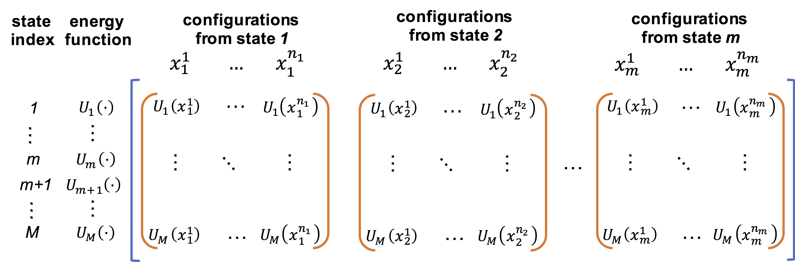

Usage
=====

**Note**: The following description of the usage of FastMBAR is provided
here to help better undertand when and how to use FastMBAR in general.
It might be too general and thus too abstract for firt-time users.
If it is the case, we recommand that you read the :ref:`examples` first ,
which can help you understand the following general descriptions.

1. When to use MBAR equations?
------------------------------

A general question in computational chemistry is to calculate
relative free energies of different thermodynamic states.
Let us assume there are :math:`M` thermodynamic states and
the :math:`k` th state has a reduced potential energy function of
:math:`U_k(x)`, where :math:`x` represents a system conformation.
The probability distribution of conformations :math:`x` in the :math:`k` th 
state is the Boltzmann distribution
:math:`p_k(x) \propto \exp\left(-U_k(x)\right)`.
(**Note** that :math:`U_k(x)` is the reduced  potential energy function and
has included the inverse temperature :math:`\beta = 1/k_bT`, i.e., if the original
potential energy function is :math:`E_k(x)`, :math:`U_k(x)` is defined as
:math:`\beta E_k(x)`. Therefore, :math:`U_k(x)` is a unitless quantity.)
The reduced free energy of the :math:`k` th state is
:math:`F_k = -\ln \int{\exp\left(-U_k(x)\right) dx}`.
(**Note** :math:`F_k` is the reduced free energy and is also unitless.
To convert it into a free energy with an energy unit, you need to mutiply it
by :math:`k_bT`, i.e., :math:`k_bT F_k`.)
There are many ways to compute the relative free energies of
the :math:`M` states and one of them is as follows:

1. Sample conformations from each of the :math:`M` states separately using
   either molecular dynamcis or Monte Carlo sampling.

2. Reweight the above sampled conformations from all the :math:`M` states
   to compute the relative free energies.

Let us assume that :math:`N_k` conformations are sampled from the :math:`k` th
state in the first step and they are represented as :math:`\{x^{n}_k, n = 1, ..., N_k\}` for
:math:`k = 1, ..., M`.
MBAR equations are used in the second step to reweight conformations and
compute relative free energies :math:`F_k` for :math:`k = 1, ..., M`.
After MBAR equations are solved in the second step, they can also be used
to calculate relative free energies of perturbed states from which no
conformations are sampled. Let us assume there are :math:`L` perturbed states
and the :math:`l` th perturbed state has a reduced potential energy function
of :math:`U^{\prime}_l(x)`.

The situation described above is quite general and it includes **alchemical
free energy calculation** and calculating potential of mean force (PMF) with
**umbrella sampling** or **temperature/Hamiltonian replica exchange simulations**.

2. How to use FastMBAR?
-----------------------
The following two inputs are required to initialize FastMBAR: a matrix :math:`A` of reduced
potential energies in sampled states and a vector :math:`v` of numbers of sampled
conformations from each state, both of which can be calculated based on sampling.

If the sampling is conducted as described above, the matrix of reduced potential
energies in sampled states should be calculated as the matrix :math:`A_{M,N}` as shown in the
blue bracket in the following figure:

	   
The matrix :math:`A` has :math:`M` rows and :math:`N` columns, where :math:`M` is
the number of states from which conformations are sampled and :math:`N` is the
total number of conformations sampled from all states, i.e.,
:math:`N = \sum_{k=1}^{M} N_k`.
The reduced potential energy of each conformation, no matter which state it is
sampled from, is evaluated in all :math:`M` states.
These :math:`M` reduced potential energies constitue one column of the matrix
:math:`A`.
The vector :math:`v` is constructed as :math:`v = (N_1, N_2, ..., N_M)`.

In FastMBAR, both the matrix :math:`A` and the vector :math:`v` have to be
`numpy arrays <https://numpy.org/devdocs/user/quickstart.html>`_: :math:`A` is a
two dimensional numpy array and :math:`v` is a one dimensional numpy array.
With the matrix :math:`A` and the vector :math:`v`, we can create a FastMBAR object
using the following `Python` command:

.. code-block:: Python

   # import both Numpy and FastMBAR package
   import numpy as np
   from FastMBAR import *

   # construct the energy matrix A and the vector v   
   ...
   
   # construct and initialize a FastMBAR object with the energy matrix A and the vector v
   # set cuda = True in the following command if you want to run the calcuation on GPUs
   fastmbar = FastMBAR(energy = A, num_conf = v, cuda=False, verbose = True) 

   # after initialization, the relative free energies of the M states is stored in fastmbar.F
   print(fastmbar.F)

FastMBAR can also compute the uncertainty of the estimated relative free energies using
the following command.

.. code-block:: Python

   # import both Numpy and FastMBAR package
   import numpy as np
   from FastMBAR import *

   # construct the energy matrix A and the vector v   
   ...

   # construct and initialize a FastMBAR object with the energy matrix A and the vector v
   # set cuda = True in the following command if you want to run the calcuation on GPUs
   fastmbar = FastMBAR(energy = A, num_conf = v, cuda=False, bootstrap = True, verbose = True)

   # after initialization, the relative free energies of the M states and standard deviations
   # are stored in fastmbar.F and fastmbar.F_std, respectively.
   print(fastmbar.F)
   print(fastmbar.F_std)

As stated above, the FastMBAR object constructed using the matrix :math:`A`
and the vector :math:`v` can also be used to compute the relative free energies
for perturbed states from which no conformations are sampled. In order to do that,
a seperate reduced potential energy matrix :math:`B` is required.
The matrix :math:`B` has :math:`L` rows and :math:`N` columns, where :math:`L` is
the number of perturbed states and :math:`N` is the
total number of conformations sampled from the previous :math:`M` states,
i.e., :math:`N = \sum_{k=1}^{M} N_k`.
As shown in the red bracket in above figure, the energy term :math:`B_{l,n}` in the matrix
:math:`B` is calculated as the reduced potential energy of the :math:`n` th conformation in
in the :math:`l` th perturbed states.
With the matrix :math:`B` and the FastMBAR object constructed using the matrix :math:`A` and the
vector :math:`v`, the relative free energies of the perturbed states can be calculated using
the following command:

.. code-block:: python
		
   ## calculate relative free enegies of perturbed states
   F_perturbed, F_perturbed_std = fastmbar.calculate_free_energies_of_perturbed_states(B)

   ## relative free enegies of perturbed states
   print(F_perturbed)

   ## standard deviation of relative free enegies of perturbed states   
   print(F_perturbed_std)   

   
   
